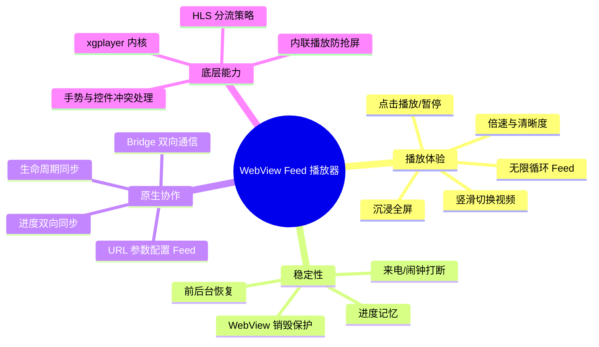
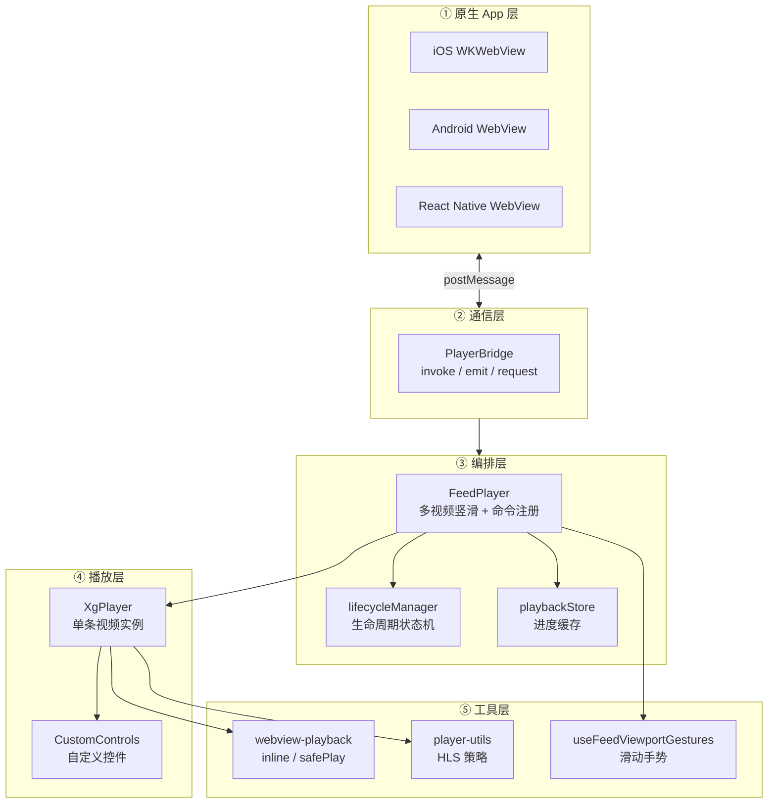
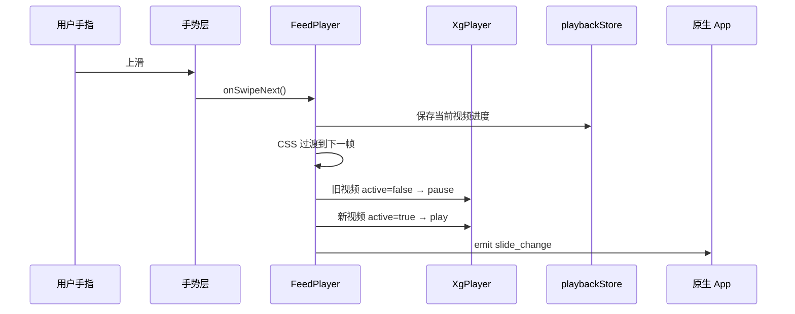
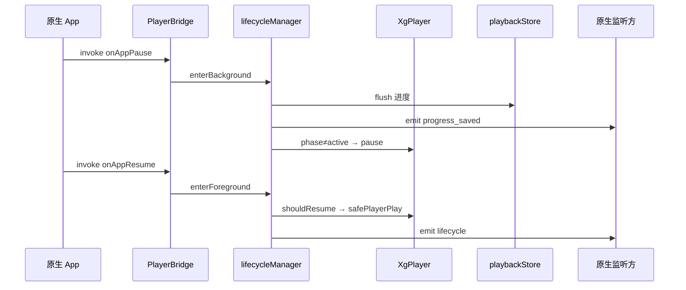
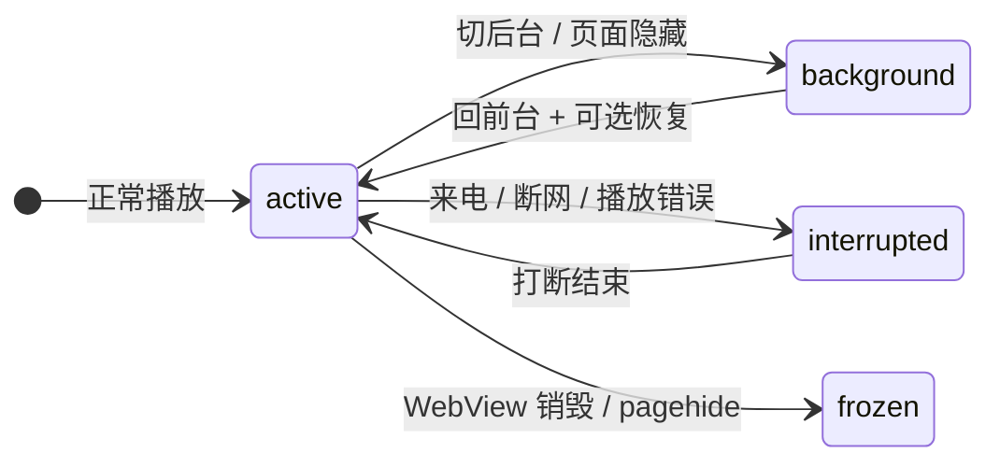
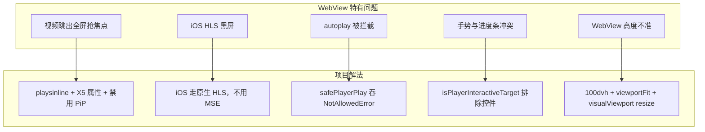
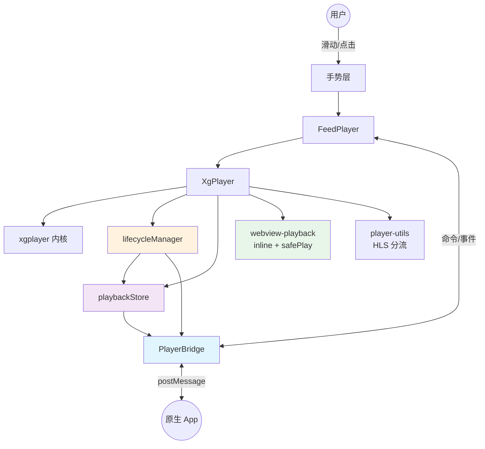

# WebView Feed 播放器 · 知识体系图

> 面向 **原生 App 内嵌 WebView** 的竖滑短视频播放器。本文用「知识体系图」方式梳理架构、难点与原生对接要点，便于产品、前端、原生同学快速对齐。

---

## 一、一张总览图



---

## 二、模块分层（从上到下）



### 各层一句话

| 层级 | 模块 | 干什么 |
|------|------|--------|
| 原生 | App WebView | 承载 H5，注入 Bridge，监听事件 |
| 通信 | `PlayerBridge` | H5 ↔ 原生的统一消息通道 |
| 编排 | `FeedPlayer` | 管理多条视频、滑动切换、注册原生命令 |
| 编排 | `lifecycleManager` | 前后台/打断/销毁的状态机 |
| 编排 | `playbackStore` | 记住每条视频看到哪了 |
| 播放 | `XgPlayer` | 基于 xgplayer 的单视频播放 |
| 播放 | `CustomControls` | 进度条、倍速、清晰度、沉浸按钮 |
| 工具 | `webview-playback` 等 | WebView 特有能力补丁 |

---

## 三、核心数据流

### 3.1 用户滑到下一个视频



### 3.2 App 切后台再回来



---

## 四、知识体系 · 播放体验

```mermaid
flowchart LR
    subgraph 竖滑 Feed
        A1[首尾克隆实现无限循环]
        A2[translate3d 动画切换]
        A3[switchingRef 防连滑错乱]
        A4[每条视频独立 player 实例]
    end

    subgraph 手势
        B1[capture 阶段监听]
        B2[控件区域不触发滑动]
        B3[沉浸模式关闭滑动]
        B4[轻点 = 播放/暂停]
    end

    subgraph 沉浸全屏
        C1[不用系统全屏]
        C2[CSS 沉浸 + 横竖屏适配]
        C3[横屏视频旋转布局]
    end

    竖滑 Feed --> 手势 --> 沉浸全屏
```

### 关键文件

| 能力 | 文件 |
|------|------|
| Feed 编排 | `src/components/FeedPlayer.tsx` |
| 单视频播放 | `src/components/XgPlayer.tsx` |
| 自定义控件 | `src/components/CustomControls.tsx` |
| 滑动手势 | `src/hooks/useFeedViewportGestures.ts` |
| 横竖屏判断 | `src/lib/video-orientation.ts` |

---

## 五、知识体系 · 稳定性



### 进度记忆

```
用户观看
  → XgPlayer 定时/事件上报
  → playbackStore 写入内存
  → 防抖 1.5s 写 localStorage
  → 关键时刻 immediate 立刻落盘
  → flush 时通过 Bridge 通知原生
```

| 触发落盘 | 场景 |
|----------|------|
| 定时 | 播放中每 2s |
| 立即 | pause、切视频、组件卸载 |
| flush | 切后台、WebView 销毁 |

### 谁能触发 pause？

1. 视频 `active` 变为 false（滑走）
2. `lifecycleManager` 阶段不是 `active`
3. `document.visibilityState` 不是 `visible`
4. 原生调用 `pause` 命令

### 谁能触发 resume？

必须同时满足：

- 当前视频 `active = true`
- 生命周期 `phase = active`
- 页面可见
- `wasPlaying = true` 或原生明确要求恢复

→ 最终通过 `safePlayerPlay()` 调用，吞掉 autoplay 拒绝错误。

---

## 六、知识体系 · 原生嵌套（重点）

### 6.1 Bridge 通信模型

```mermaid
flowchart LR
    subgraph H5
        WP[window.WebPlayerBridge]
        PB[PlayerBridge 类]
    end

    subgraph 出站 H5→原生
        E[emit 事件通知]
        R[request 请求-响应]
    end

    subgraph 入站 原生→H5
        I[invoke 调用命令]
        M[postMessage 消息]
    end

    subgraph 原生通道
        iOS[webkit.messageHandlers]
        AND[AndroidBridge]
        RN[ReactNativeWebView]
    end

    WP --> PB
    PB --> E & R
    I & M --> PB
    E & R --> iOS & AND & RN
    iOS & AND & RN --> I & M
```

### 6.2 原生 → H5 命令清单（invoke）

| 命令 | 参数 | 作用 |
|------|------|------|
| `play` | — | 播放当前视频 |
| `pause` | — | 暂停 |
| `togglePlay` | — | 切换播放状态 |
| `seek` | `{ time }` | 跳转进度 |
| `scrollToIndex` | `{ index }` | 跳到第 N 条 |
| `setPlaybackRate` | `{ rate }` | 设置倍速 |
| `getPlaybackRate` | — | 查询倍速 |
| `setDefinition` | `{ definition }` | 切换清晰度 |
| `getDefinitions` | `{ videoId? }` | 查询清晰度列表 |
| `getActiveIndex` | — | 当前索引 |
| `getState` | — | 完整播放状态 |
| `getAllProgress` | — | 导出全部进度 |
| `setAllProgress` | `{ records }` | 批量注入进度 |
| `onAppPause` | — | App 进入后台 |
| `onAppResume` | `{ resume? }` | App 回前台 |
| `onAudioInterrupt` | — | 音频被打断（来电等） |
| `onAudioInterruptEnd` | `{ resume? }` | 打断结束 |
| `onWebViewDestroy` | — | WebView 即将销毁 |
| `restoreProgress` | `{ records }` | 恢复历史进度 |

### 6.3 H5 → 原生事件清单（emit）

| 事件 | 何时触发 | 原生建议用途 |
|------|----------|--------------|
| `feed_ready` | Feed 加载完成 | 初始化 UI、拉进度 |
| `slide_change` | 切换视频 | 埋点、同步业务 UI |
| `progress_saved` | 进度落盘 | 持久化到 App 数据库 |
| `lifecycle` | 生命周期变化 | 配合恢复策略 |
| `playback_rate_change` | 倍速变化 | 同步设置 |
| `definition_change` | 清晰度变化 | 埋点、带宽统计 |
| `bridge_reply` | request 的响应 | 异步回调 |

### 6.4 原生集成检查清单

```
□ 1. 加载 URL：/player?urls=...&ids=...&index=0&bridge=WebViewBridge
□ 2. 确认收到 feed_ready
□ 3. App onPause  → invoke("onAppPause")
□ 4. App onResume → invoke("onAppResume", { resume: true })
□ 5. 来电开始     → invoke("onAudioInterrupt")
□ 6. 来电结束     → invoke("onAudioInterruptEnd")
□ 7. 销毁 WebView → invoke("onWebViewDestroy")，等 progress_saved
□ 8. 冷启动注入   → invoke("restoreProgress", { records })
□ 9. 监听 slide_change 做业务埋点
□ 10. 需要 token 时：H5 request → 原生 bridge_reply
```

### 6.5 URL 参数说明

```
/player
  ?urls=url1|url2|url3          # 视频地址，| 分隔
  &ids=id1|id2|id3              # 视频 ID（必填，用于进度 key）
  &posters=p1|p2|p3             # 封面（可选）
  &definitions={JSON}           # 多清晰度配置（可选）
  &index=0                      # 起始条索引
  &live=1                       # 直播模式
  &bridge=WebViewBridge         # Bridge 名称（iOS 用）
```

---

## 七、知识体系 · 底层技术难点



### HLS 分流策略（一句话）

| 环境 | 策略 |
|------|------|
| iOS / Safari WebView | 原生 HLS，**不加** xgplayer-hls |
| Android Chrome WebView | 可用 xgplayer-hls（MSE） |
| 不支持 | 警告 + 无法播放 |

### 内联播放属性（防抢屏）

在 `XgPlayer` 和 `webview-playback.ts` 中设置：

- `playsinline` / `webkit-playsinline`
- `x5-playsinline` / `x5-video-player-type: h5`
- `x5-video-player-fullscreen: false`
- `disablePictureInPicture: true`

并在 `READY`、`CANPLAY` 时重复应用，防止 xgplayer 重建 video 后丢失。

---

## 八、文件索引（按职责）

```
src/
├── components/
│   ├── FeedPlayer.tsx      # 编排中心：Feed + Bridge + 手势
│   ├── XgPlayer.tsx        # 单视频 xgplayer 封装
│   └── CustomControls.tsx  # 自定义播放控件
├── hooks/
│   ├── useFeedViewportGestures.ts  # 视口级滑动手势
│   └── useVerticalSwipe.ts         # 组件级滑动（备用）
├── lib/
│   ├── jsbridge.ts         # PlayerBridge 通信
│   ├── lifecycle-manager.ts# 生命周期状态机
│   ├── playback-store.ts   # 进度存储
│   ├── webview-playback.ts # inline / safePlay
│   ├── player-utils.ts     # HLS 策略、时间格式化
│   ├── video-orientation.ts# 横竖屏判断
│   └── pointer-utils.ts    # 手势与控件冲突
└── app/player/
    ├── page.tsx            # 播放器页面入口
    └── PlayerContent.tsx   # URL 参数解析
```

---

## 九、角色视角速查

### 前端同学

- 改播放逻辑 → `XgPlayer.tsx`
- 改滑动/切换 → `FeedPlayer.tsx` + `useFeedViewportGestures.ts`
- 改控件 UI → `CustomControls.tsx`
- 加 Bridge 命令 → `FeedPlayer.tsx` 的 `bridge.register(...)`

### 原生同学

- 注入 Bridge → 对接 `jsbridge.ts` 中的 iOS/Android/RN 通道
- 生命周期 → 调用 `onAppPause` / `onAppResume` 等
- 进度同步 → 监听 `progress_saved`，冷启动用 `restoreProgress`
- 播放控制 → `invoke("play")` / `invoke("seek")` 等

### 产品 / 测试同学

- 核心体验：上下滑切视频、点击暂停、进度记忆、后台恢复
- 必测场景：切后台、来电、断网、快速连滑、横屏视频沉浸、多清晰度切换
- 验收标准：进度不丢、不误播（后台无声）、手势不与进度条冲突

---

## 十、概念关系总图



---

*文档版本：与代码库同步梳理 · 路径 `docs/player-knowledge-map.md`*
